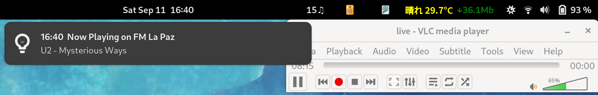

## Gnome-Shell Extension

Since there's a security issue with the lapaz.fm get current song url (server side) the only way to get such info is by using an external Shell script to first load the url with some restrictions, get desired data and parse it back to the gnome-extension.

## issue
When the extension updates the info it slows down for a second the system, it becomes unresponsive, this happens every 235s, which is the updating time.

### Javascript error for <extension_.js>

All these files are in depr dir. Someday I will try to fix them, though passing that Obj0fx3c... sth sth error will be a useless challenge. I'd better review some working gnome-extension that uses Soup Library. 

## running environment

Gnome version: 42.4

PC: Panasonic Let'sNote / Fedora 36

Programming language: JavaScript

Editor: Emacs

